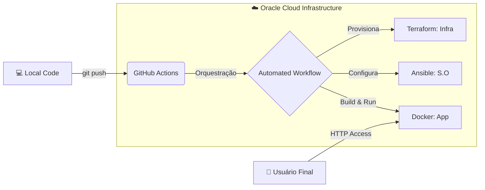

# 🚀 DevOps Journey: Full Automation Pipeline
**by Alison Melo**

Este projeto é uma demonstração prática de um ciclo **CI/CD End-to-End**, focado em automação total, provisionamento como código e resiliência em nuvem.

  &nbsp;
  &nbsp;
  &nbsp;
  &nbsp;
  &nbsp;
  

---

## 📊 Arquitetura do Sistema

---

## 🧰 Stack Tecnológico

* **Cloud Provider:** Oracle Cloud Infrastructure (OCI)
* **Infraestrutura como Código (IaC):** Terraform
* **Gerência de Configuração:** Ansible
* **Containerização:** Docker (Nginx/Alpine)
* **Automação de CI/CD:** GitHub Actions
* **Sistema Operacional:** Ubuntu Server

---

## 🛠️ Detalhes da Implementação

| Tecnologia | Função | Descrição |
| :--- | :--- | :--- |
| **Terraform** | IaC | Provisionamento de rede (VCN), Firewall e Instância AMD em Ashburn. |
| **Ansible** | Config Management | Hardening do S.O, liberação de IPtables e orquestração do Docker. |
| **Docker** | Containerization | Empacotamento da aplicação em imagem isolada e imutável. |
| **GitHub Actions** | CI/CD | Pipeline automatizado que dispara o deploy a cada alteração no código. |

---

## 🔗 Acesse o Projeto
O site está no ar e é atualizado automaticamente a cada alteração neste repositório:
👉 **[http://157.151.233.30](http://157.151.233.30)**

---

  <i>"A automação é a única forma de garantir que o sucesso seja previsível."</i>

